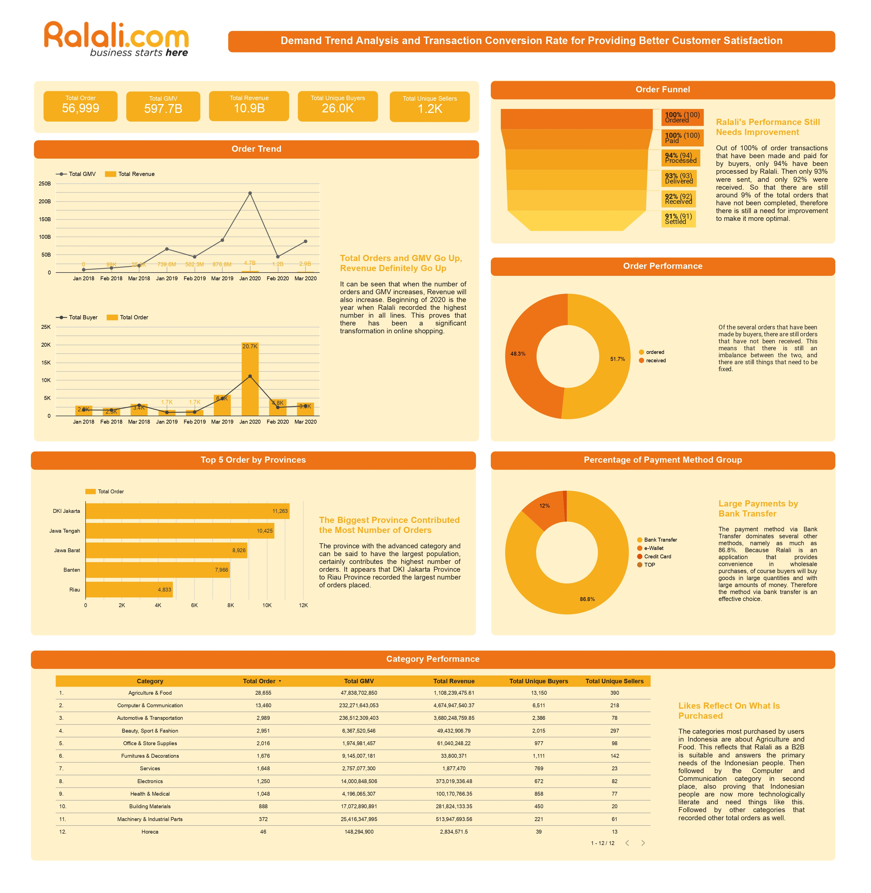

# Demand Trend Analysis and Transaction Conversion Rate for Providing Better Customer Satisfaction

Ralali is one of the largest business units in the Ralali ecosystem which operates as a Marketplace Platform where this platform connects users (buyers and sellers) for B2B business models in Indonesia. Ralali requires several metrics and analysis which will later be used to measure transaction performance at Ralali. Students can provide insights and solutions for Ralali.

## 📷 Visualization Result

## ✨ More Information

This is the final project that was worked on during the Studi Independen Kampus Merdeka Batch 3 at Bitlabs Academy
